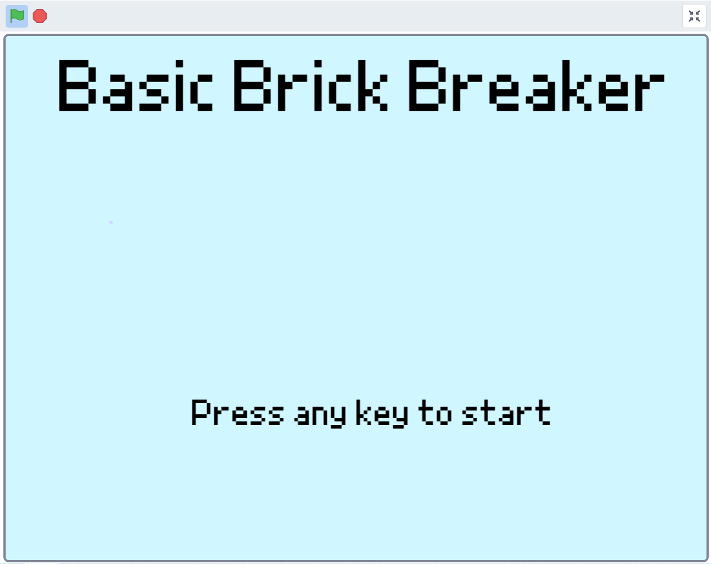
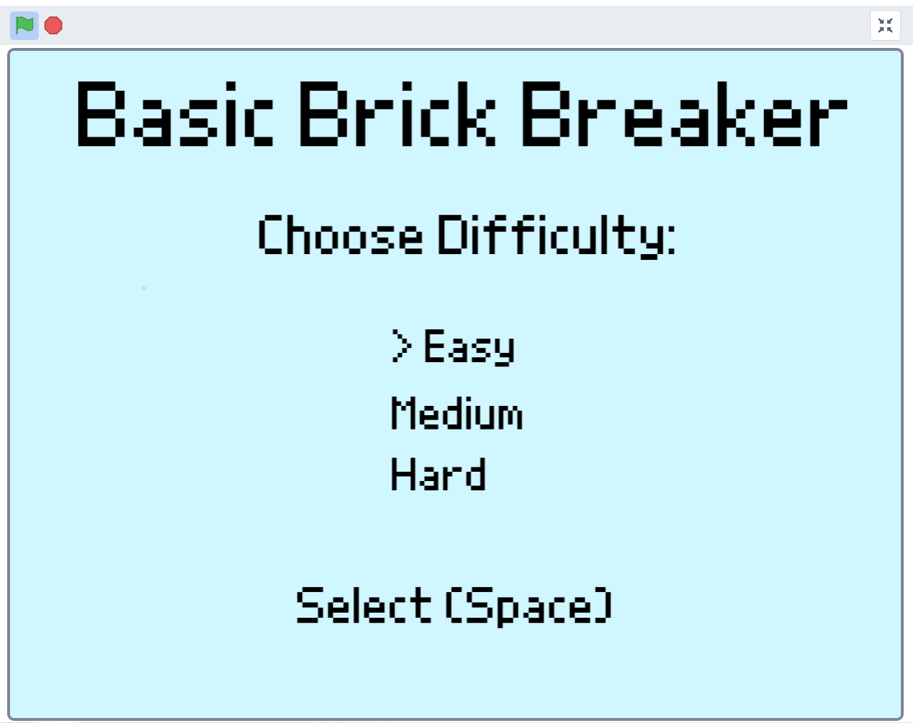
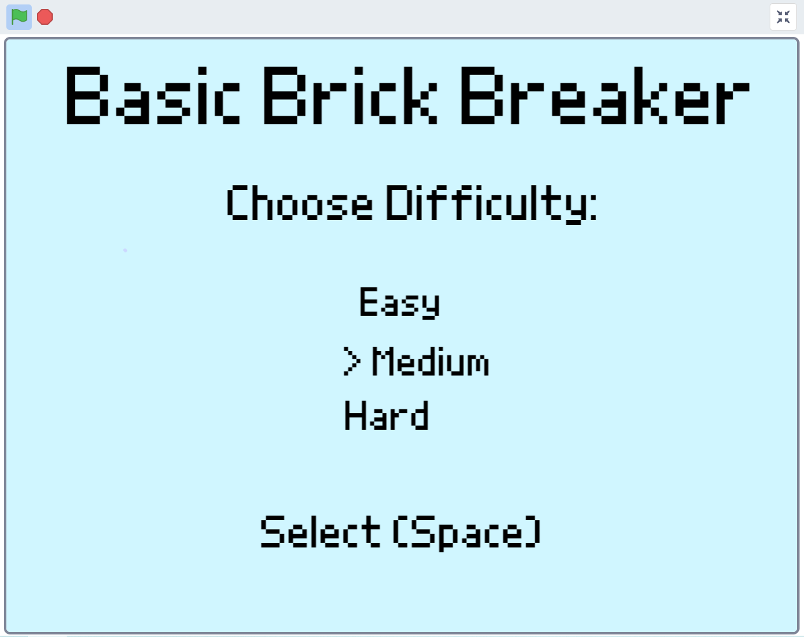
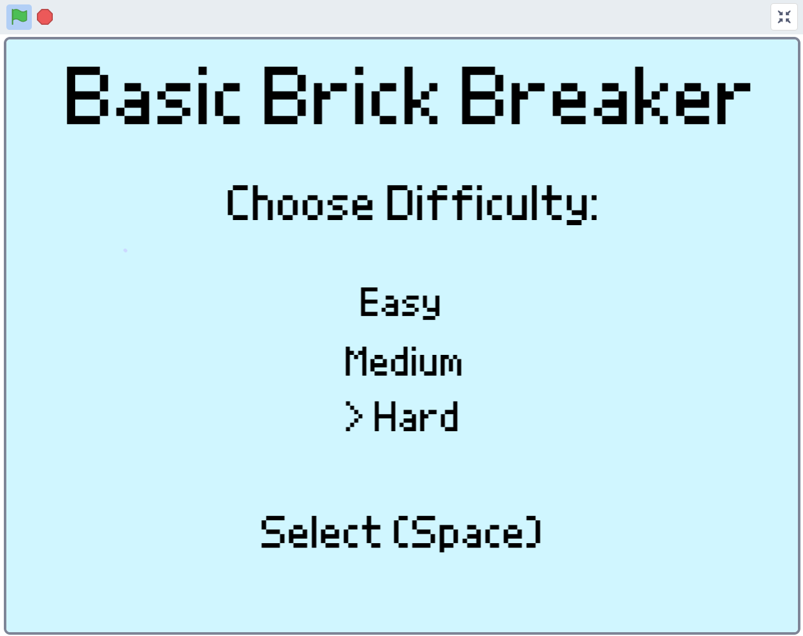
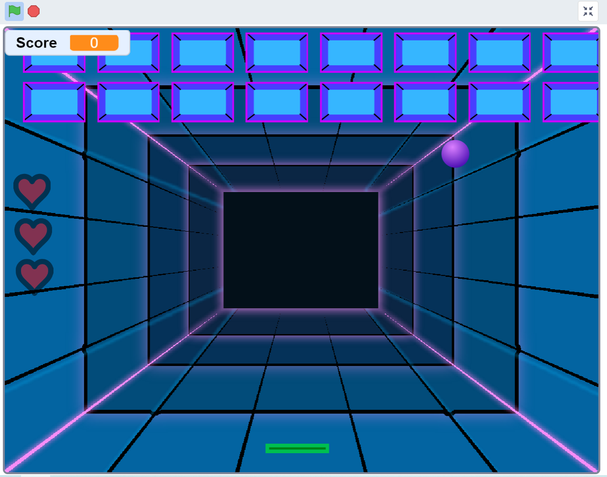
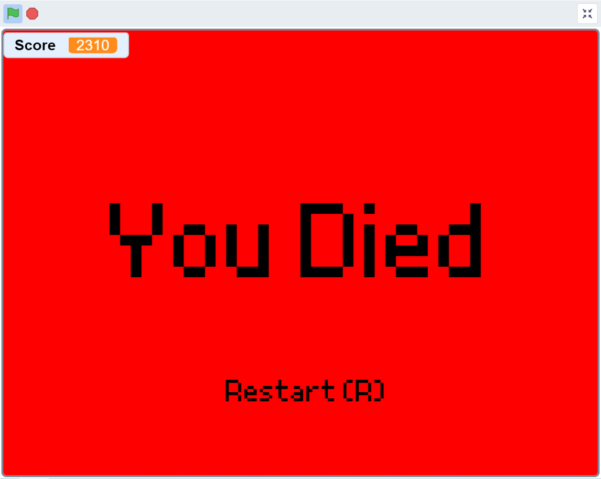

# BasicBrickBreaker
Basic Brick Breaker game programmed in the Scratch visual programming language
- [Overview](#overview)
- [Level selection](#level-selection)
- [Gameplay](#gameplay)
- [Ending](#ending) 

## Overview
This game is a very basic remake of the classic game.
Using a bouncing ball and a paddle, the goal is to break all bricks and clear the level.
The game ends when a player loses all his lives.

## Level selection

Upon launching the game the player is greeted with a title screen.
To continue to the level selection any key can be pressed.

	
	
	

The game features three difficulty settings. Each difficulty level corresponds to a number of lives at the start of a game. When choosing a harder mode, the number at the start decreases.
To start a game, simply press space.

## Gameplay

After level selection the playing field is shown and a ball is launched from the paddle.
A touched brick will immediately dissappear from the playing field.
Each touched brick adds 100 points to the score. Every area cleared adds 1000 additional points.
The ball automatically bounces when it touches a boundary wall, except for the bottom.
Player lives are displayed on the left side.
One live is subtracted each time the player fails to bounce the ball back towards the bricks.
Otherwise the game continues indefinetely.
After each 10 000 points, the background changes to the next scene.

## Ending

If the player loses all of their lives, the game over screen is shown.
The final score is displayed in the left upper corner.
To start a new game, simply restart using the R key.
